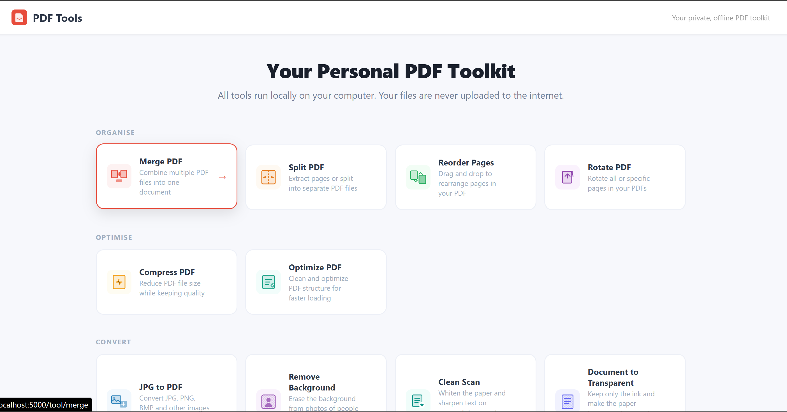
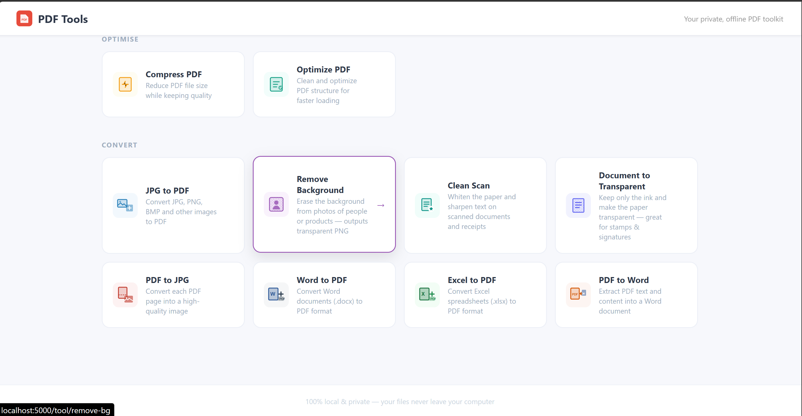

# 📄 PDF Tools — Your Private, Offline PDF Toolkit

A local web app that does everything the popular online PDF sites do — **merge, split, convert, compress, rotate, clean scans, remove backgrounds** — but runs entirely on **your own computer**.

> 🔒 **Your files never leave your machine.** No uploads, no servers, no internet required (after setup). Perfect for sensitive documents you don't want to send to a website.

---

## 📸 Screenshots

| Home — all tools | Clean Scan in action |
|:---:|:---:|
|  |  |

> _Drop your own PNG screenshots into the `screenshots/` folder using these exact names and they'll appear here automatically._

---

## ✨ Features

| Tool | What it does |
|------|--------------|
| **Merge PDF** | Combine multiple PDFs into one |
| **Split PDF** | Extract specific pages, or split every page into its own file |
| **Reorder Pages** | Drag-and-drop page thumbnails to rearrange |
| **Rotate PDF** | Rotate all or selected pages 90° / 180° / 270° |
| **Compress PDF** | Shrink file size (shows you how much was saved) |
| **Optimize PDF** | Clean and streamline the PDF structure |
| **JPG → PDF** | Turn images (JPG, PNG, BMP, TIFF, WEBP…) into a PDF |
| **PDF → JPG** | Export each page as a high-quality image |
| **Word → PDF** | Convert `.doc` / `.docx` to PDF *(Windows + MS Word)* |
| **Excel → PDF** | Convert `.xls` / `.xlsx` to PDF *(Windows + MS Excel)* |
| **PDF → Word** | Extract a PDF's text into an editable `.docx` |
| **Remove Background** | AI cut-out for photos of people/products → transparent PNG |
| **Clean Scan** | Whiten paper & sharpen text on scanned documents |
| **Document to Transparent** | Keep only the ink, make paper transparent (stamps/signatures) |

✅ Most tools support **batch processing** — drop several files and get a ZIP back.

---

## 🚀 Quick Start (Windows)

1. **Install [Python 3.10+](https://www.python.org/downloads/)** (tick *"Add Python to PATH"* during install).
2. **Download this project** — click the green **Code → Download ZIP** button above, then unzip it.
3. **Double-click `install.bat`** — installs the required libraries (one time).
4. **Double-click `start.bat`** — opens the app in your browser at `http://localhost:5000`.

That's it. Use it like any online PDF tool — but offline.

### Manual start (any OS)

```bash
pip install -r requirements.txt
python app.py
# then open http://localhost:5000
```

---

## ⚠️ Notes

- **Word → PDF** and **Excel → PDF** require **Microsoft Word / Excel installed** and currently work on **Windows only** (they drive Office via COM automation). Every other tool is cross-platform.
- **Remove Background** downloads a one-time AI model (~176 MB) on first use, then works fully offline.
- This runs a local development server intended for **personal use on your own machine** — it is not hardened for public internet hosting.

---

## 🛠️ Built With

- [Flask](https://flask.palletsprojects.com/) — local web server
- [PyMuPDF](https://pymupdf.readthedocs.io/) — PDF engine
- [Pillow](https://python-pillow.org/) — image processing
- [rembg](https://github.com/danielgatis/rembg) — AI background removal
- [python-docx](https://python-docx.readthedocs.io/) + MS Office automation — document conversion

---

## 📜 License

[MIT](LICENSE) — free to use, modify, and share. Attribution appreciated.

---

*Built because I love PDFs — and I'd rather not upload my documents to a website. If this helps you too, a ⭐ on the repo is welcome!*
